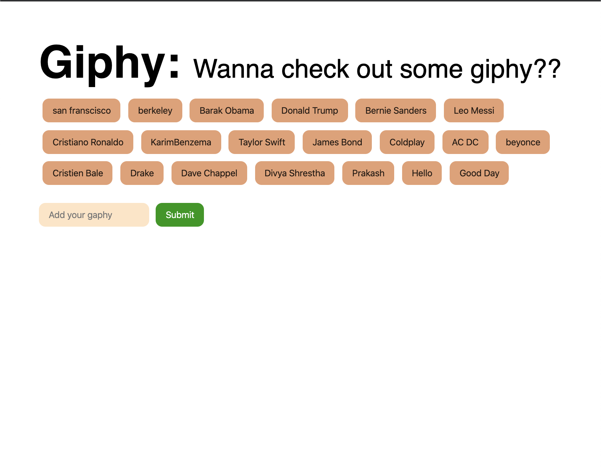

# GifTastic-API

<h1>Overview</h1>

This app allows you to control animated gifs (start/stop animation).

First select a category, and it will select the 10 most popular gifs with that category from the GIPHY website.

You can add new categories of your own. If no results are returned, then your category will not be entered. But if there are, then a button with that category will be added.

Each gif can be animated by clicking on the picture. They will stop if you click on them a 2nd time.

Have fun!

Click to see the app: https://pracharya2601.github.io/GifTastic-API/?

<h2>Technology used:</h2>
<ul>
<li>HTML</li>
<li>CSS</li>
<li>JavaScript</li>
<li>jQuery</li>
<li>Ajax</li>
<li>API</li>
</ul>

     

     

